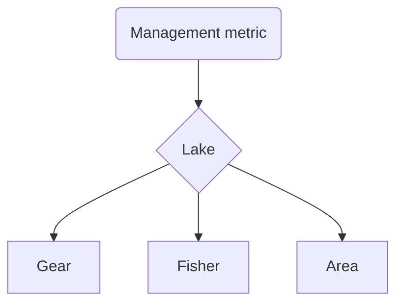

How can fishing derbies be designed in such a way to be more useful for recreational fishing monitoring and management?

```mermaid
graph TD
A(Management metric)-->B{Lake}
B-->C[Gear]
B-->D[Fisher]
B-->F[Area]
```
